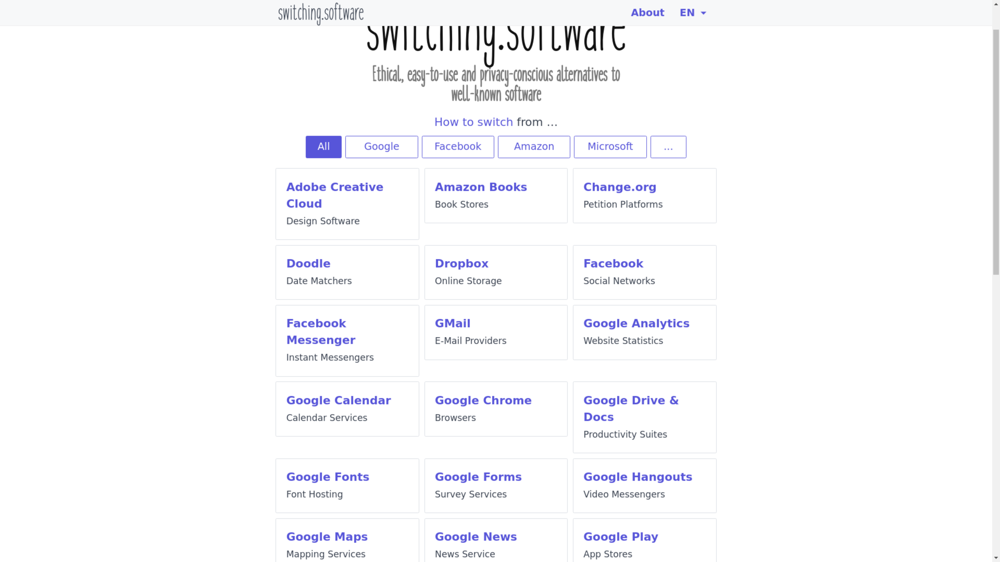
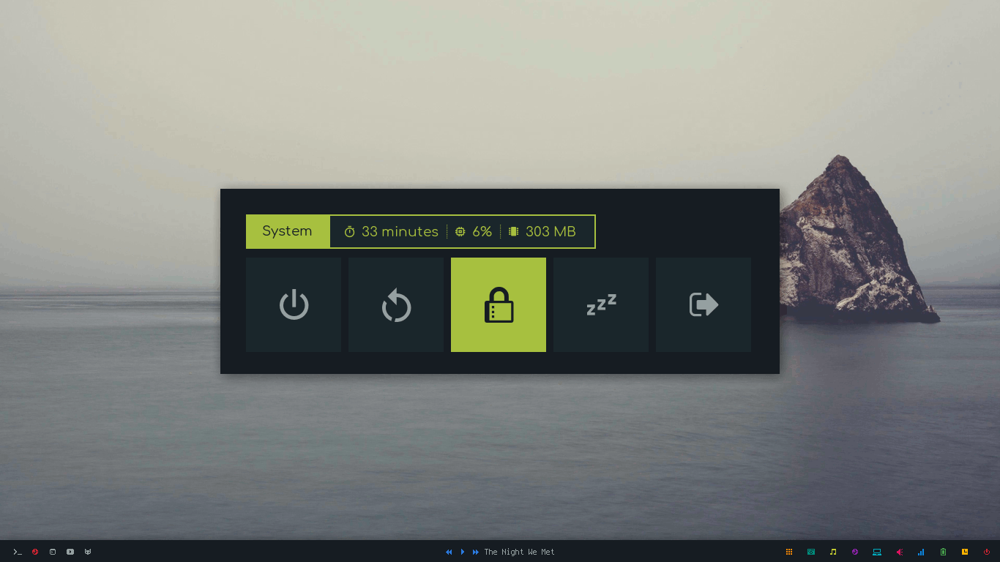
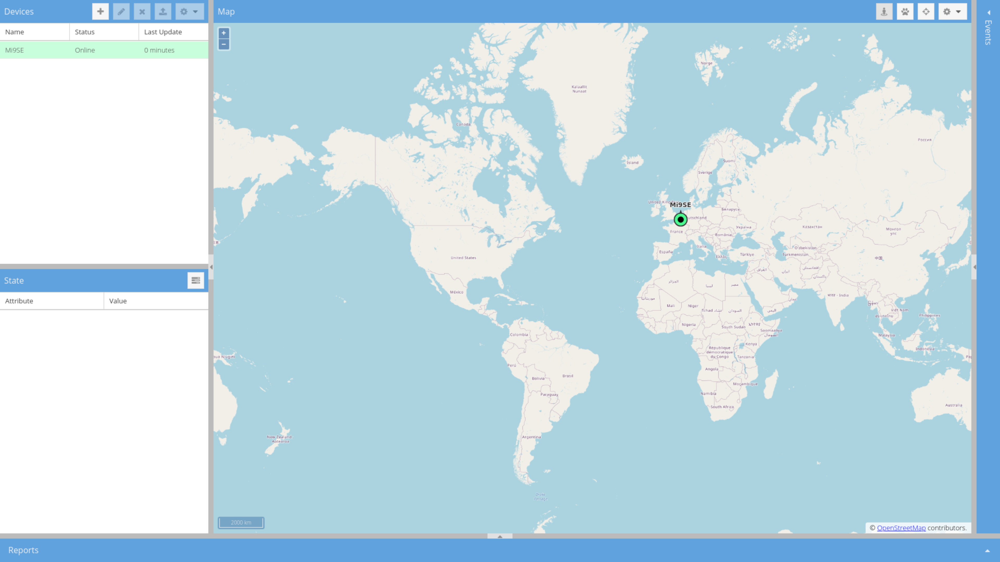
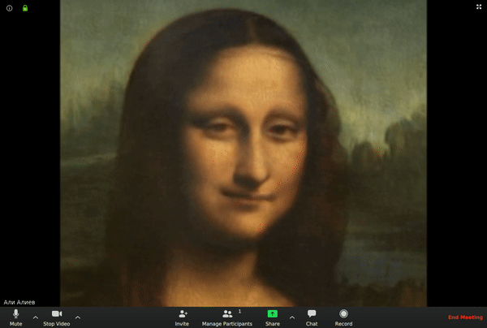

Hi coders,
This was a small week, with some intersting discoveries, not a lot of tips through.

### Projects

- [GuessJS](https://github.com/guess-js/guess): A JS library that uses analytics and machine learning to guess the next page/piece of content/... the user is most likely to interact with next. Under MIT.
- [Switching Software](https://switching.software/): A website that list alternatives to GAFAM's services. Under  CC BY-SA 4.0.

- [Rofi Applets & Menus](https://github.com/adi1090x/rofi): A collection of beautiful rofi-based scripts for things like power, music, backlight, ... Under GPLv3.

- [Build your own X](https://github.com/danistefanovic/build-your-own-x): A list of tutorial for recreating programs. They explain in different languages how to rebuild git, React, an operating system or even a programming language. The list is in the public domain, but the differents articles have their own licenses.
- [Traccar](https://www.traccar.org/client/): A project that can be selfhosted which track your position in realtime. Some will say it's a bad idea, but I wanted to use something like that to work with my [Home Assistant](https://www.home-assistant.io/) setup. Under Apache.

- [Avatarify](https://github.com/alievk/avatarify): In this time of lockout and home working, video conferences prank arebecoming more and more popular. This project uses machine learning to "deep-fake" a picture, the only issue with it is that you'll need a powerful GPU to make it work. Under CC BY-NC 4.0.
<picture style="display: flex; width: 100%; justify-content: center; align-items: center">

</picture>
- [AltStore](https://github.com/rileytestut/AltStore): This is a project to help people sideload ipa files on their iOS devices. ipa's do not need to be signed by Apple as long as you own a development signing certificate, which can be obtained by paying Apple 99 € or in some places over the internet. This is a really cool project because it will open the door to more pojects like [Delta](https://github.com/rileytestut/Delta) that could be developped independently of Apple's rules. Under AGPLv3 due to dependencies but the author gives explicit permission to use, modify and distribute with or without attribution.

### Tips

- [Compose key](https://en.wikipedia.org/wiki/Compose_key): Is a Linux specific key that can be used to tranform a normal key into its dead key alternatives. Could be really useful for people like me who write mostly in English but sometimes need to write in French.
- Github Action Badges: While implementing "unit tests" from my dotfiles, I discovered Github has a badge implementation that can be used in readme's to show which tests are passing. To do that you simply need to add that line to your project's readme:

```markdown

```

- Docker's `uname`: At the same time I discovered that the command `uname` executed in a Docker container will give you the output of the *host*. This was really not useful for me when trying to test my dotfiles in Dockers.

```bash
toum@archlinuxdocker:~$ uname -a
Linux XPS 5.3.0-40-generic #32-Ubuntu SMP Fri Jan 31 20:24:34 UTC 2020 x86_64 x86_64 x86_64 GNU/Linux
```
