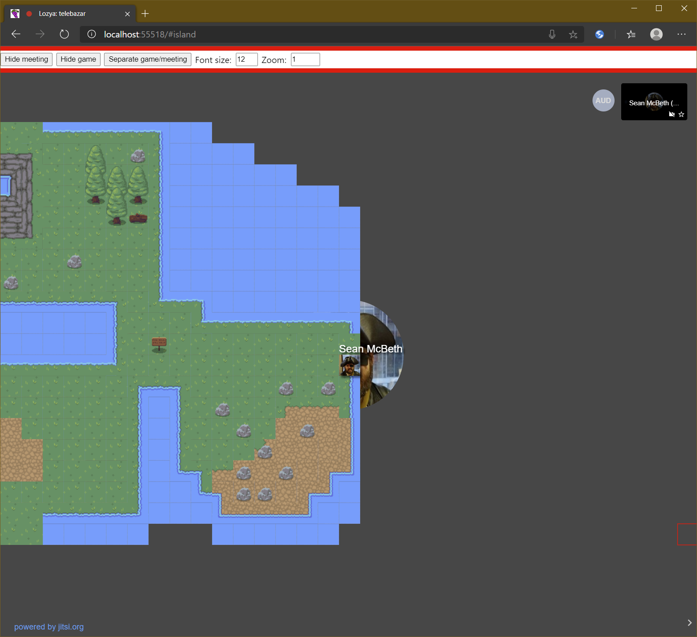
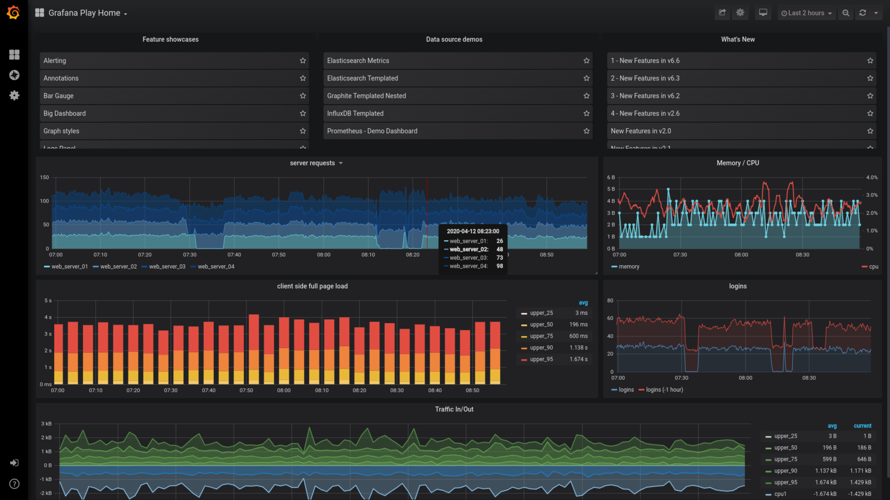
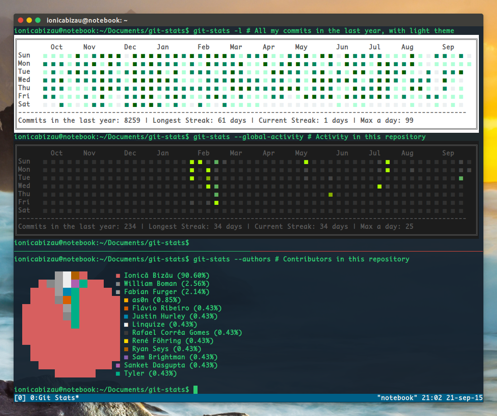
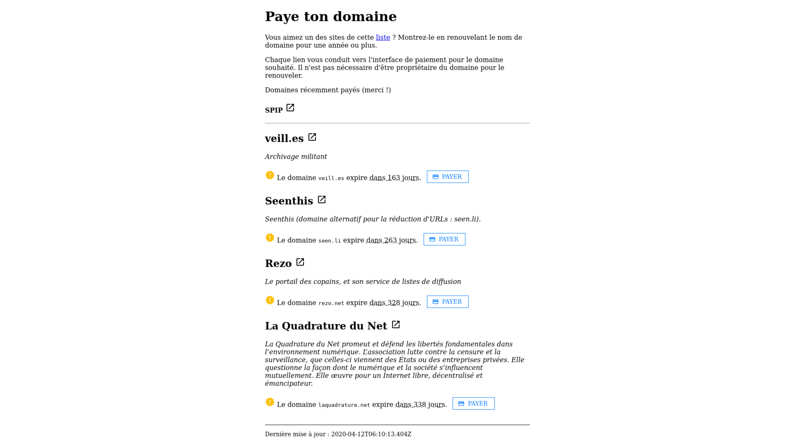
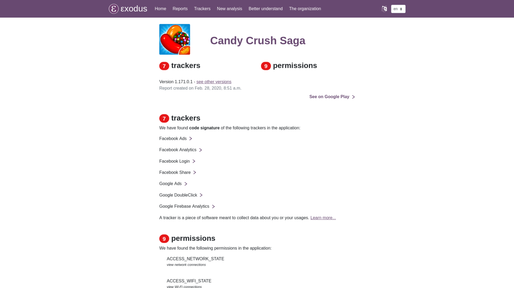

Hi everyone,

To motivate myself in writing often I am starting a weekly serie where I will 
post the interstings tips and open-source projet I found over the week.

### Projects

- [termtosvg](https://github.com/nbedos/termtosvg): A python projet to register a console session to an svg file. Under BSD 3-Clause License. It can be really cool for a quick demo or for a project's README.


- [lozya](https://github.com/capnmidnight/lozya): A hack on top of Jitsi to create a virtual meeting room where users can sit next to each other to hear each other better. I love the idea, we used to make discord rooms corresponding to parts of the open-space at the start of the lockdown. Under MIT.


- [Grafana](https://github.com/grafana/grafana): Really popular projet that I only found this week. Basically it can make a dashboard of anything. Under the Apache License.


- [git-stats](https://github.com/IonicaBizau/git-stats): A CLI tool to enable github-like commit calendar for your system. Under MIT.


- [Paye ton domaine](https://rednegra.net/payetondomaine/): This one is a bit more french related, but I like the idea. Basically you can pay for the domain name renewal of open-source actors. I don't know if somethink like that exist that is more international but it would be cool

- [Exodus](https://reports.exodus-privacy.eu.org/en/): A project that anlayse the trackers and the permissions of all apps on the Gogole play store. Go take a look at the apps you have on your phone, you might be surprise how may apps have 10 trackers and the permission to stay awake in background. Under GPLv3.


### Tips

- In bash, if you start your command with a space it should not appear in your history (really useful if you need to input a secret key or a password). In ZSH this can be achieved with `setopt histignorespace`
- Still about shells, in zsh I have found a way to make "conditional aliases". I use it manly to make aliases for alternatives programs (like using `lsd` instead of `ls`), but keep the compatibility on systems that doesn't have the alternatives installed:
```
function ls () {
    if which lsd &> /dev/null
    then
        lsd "$@"
    else
        command $0 "$@"
    fi
}
```

- Last one on shells is this command to see your most used commands on zsh:
```
history 0 | awk 'BEGIN {FS="[ \t]+|\\|"} {print $3}' | sort | uniq -c | sort -nr | head -n 15
```
- And the same on bash:
```
history | awk 'BEGIN {FS="[ \t]+|\\|"} {print $3}' | sort | uniq -c | sort -nr | head -n 15
```

- And the last one for this week will be on HTML, where I learned about the `srcset` property of the `` tag. `srcset` takes an array of images with their breakpoints and modern browser will fetch the image according to the current resolution of the window. Really useful to reduce the size of your webpage on mobile. I always thought GatsbyJS did that using some Javascript magic.
```

```
